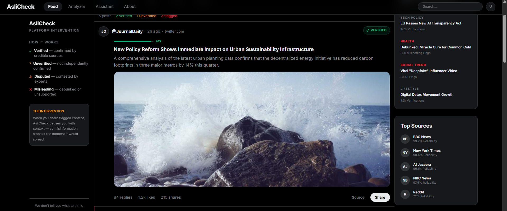
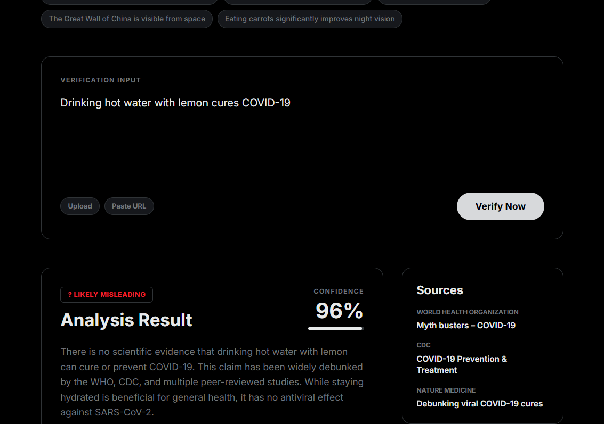

<div align="center">

# AsliCheck

**AI-powered fact-checker and news curator for the modern information age.**

[](https://react.dev)
[](https://typescriptlang.org)
[](https://vitejs.dev)
[](https://tailwindcss.com)
[](https://ollama.com)

</div>

## Screenshots

| News Feed                          | Claim Analyzer                             |
| ---------------------------------- | ------------------------------------------ |
|  |  |

---

## Overview

AsliCheck helps users fight misinformation by verifying claims, headlines, and social media posts using AI. It combines a curated news feed with real-time fact-checking, an AI-powered chat assistant, and a Chrome browser extension — all in one platform.

## Features

- **Curated News Feed** — Aggregates news from RSS sources (including Reddit) with real-time verification labels: _Verified_, _Unverified_, _Disputed_, or _Misleading_
- **Claim Analyzer** — Paste any claim, headline, or social media post and get an AI-powered authenticity analysis with confidence scores
- **AI Assistant** — Chat with an AI fact-checking assistant for explanations, source evaluation, and media literacy guidance
- **Browser Extension** — Chrome extension (Manifest V3) that lets you select text on any webpage, right-click, and verify it instantly
- **Ollama Integration** — Uses local LLMs (default: Llama 3.2) via Ollama for deep analysis, with a heuristic fallback when Ollama is unavailable
- **DeBERTa Model** — Zero-shot NLI classification using `cross-encoder/nli-deberta-v3-small` for text suspicion scoring

## Tech Stack

| Layer     | Technology                                                       |
| --------- | ---------------------------------------------------------------- |
| Frontend  | React 19, TypeScript, Vite, Tailwind CSS 4, React Router, Motion |
| Backend   | Express.js, RSS Parser, Ollama API                               |
| ML Model  | HuggingFace Transformers, DeBERTa v3 (PyTorch)                   |
| Extension | Chrome Extension (Manifest V3)                                   |

## Project Structure

```
├── src/                  # React frontend
│   ├── components/       # Navbar, Sidebar, PostCard, RightSidebar
│   ├── views/            # FeedView, AnalyzerView, AssistantView
│   ├── lib/              # API client, mock data, utilities
│   └── types.ts          # TypeScript interfaces
├── server/               # Express backend (RSS aggregation, Ollama proxy)
├── extension/            # Chrome browser extension
├── Models/               # DeBERTa Python model for text classification
└── vite.config.ts        # Vite configuration
```

## Getting Started

### Prerequisites

- **Node.js** (v18+)
- **Ollama** (optional, for full AI analysis) — [Install Ollama](https://ollama.com/download)
- **Python 3.10+** (optional, for DeBERTa model)

### Installation

```bash
# Clone the repository
git clone https://github.com/your-username/aslicheck.git
cd aslicheck

# Install dependencies
npm install
```

### Running the App

```bash
# Start both frontend and backend concurrently
npm start

# Or run them separately:
npm run dev            # Frontend only (port 3000)
npm run dev:server     # Backend only
```

### Setting Up Ollama (Optional)

For full AI-powered analysis instead of heuristic mode:

```bash
# Install and start Ollama
ollama serve

# Pull the default model
ollama pull llama3.2
```

### Setting Up the DeBERTa Model (Optional)

```bash
cd Models
pip install transformers torch
python derberta.py
```

### Loading the Chrome Extension

1. Open `chrome://extensions/` in your browser
2. Enable **Developer mode**
3. Click **Load unpacked** and select the `extension/` folder
4. Select any text on a webpage → right-click → **Verify with AsliCheck**

## Environment Variables

Create a `.env.local` file in the project root:

```env
OLLAMA_URL=http://localhost:11434    # Ollama server URL (default)
OLLAMA_MODEL=llama3.2                # Ollama model name (default)
```

## Scripts

| Command              | Description                         |
| -------------------- | ----------------------------------- |
| `npm start`          | Run frontend + backend concurrently |
| `npm run dev`        | Start Vite dev server (port 3000)   |
| `npm run dev:server` | Start Express API server            |
| `npm run build`      | Production build                    |
| `npm run preview`    | Preview production build            |
| `npm run lint`       | Type-check with TypeScript          |
| `npm run clean`      | Remove `dist/` folder               |

## License

This project is open source and available under the [MIT License](LICENSE).
